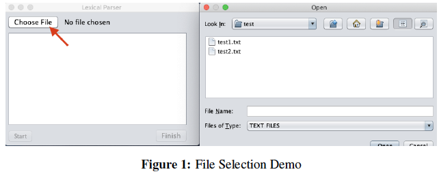
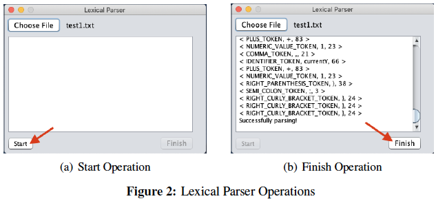
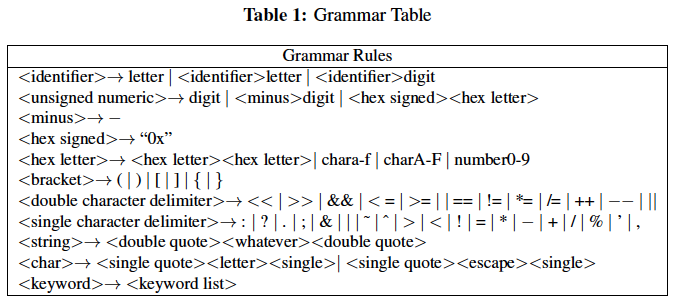
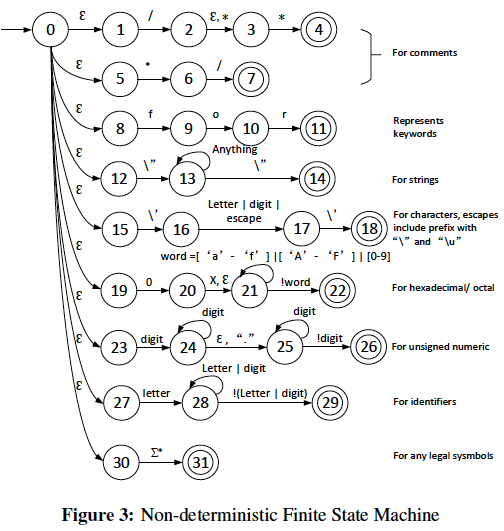
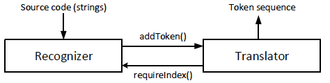
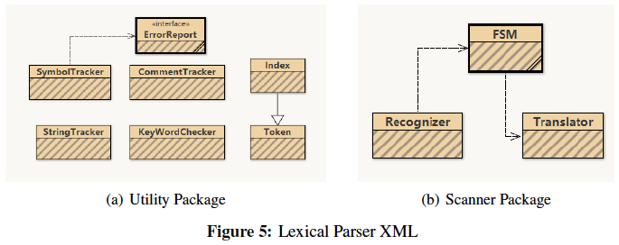
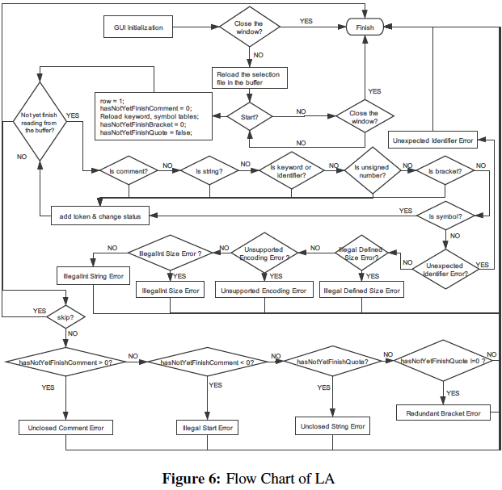
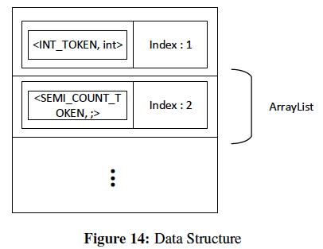
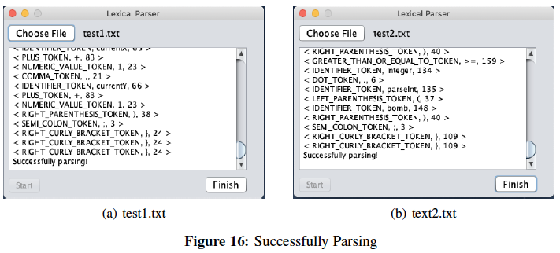
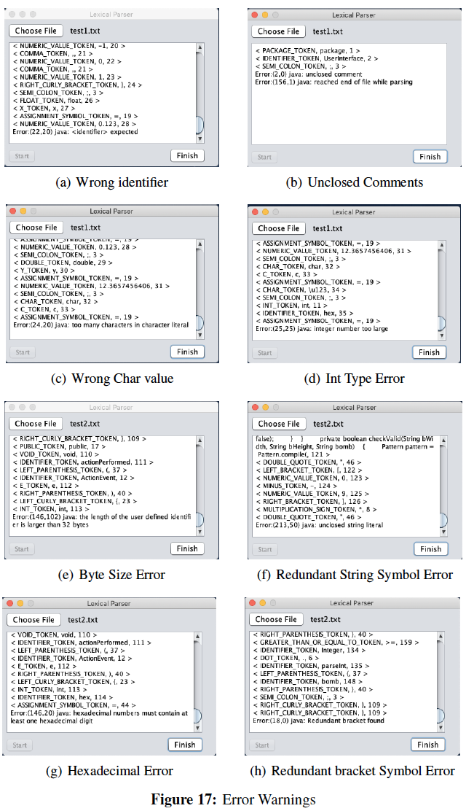

# Lexical Parser Demo 


# Lexical Parser
[](https://github.com/Hephaest/LexicalParser/blob/master/LICENSE)
[](https://www.oracle.com/technetwork/java/javase/8u202-relnotes-5209339.html)
[](https://github.com/Hephaest/LexicalParser/raw/master/download/LexicalParser_windows-x64.exe)
[](https://github.com/Hephaest/LexicalParser/tree/master/src)

English | [中文](README_CN.md)

Last updated on `2019/12/19`

## Introduction
The lexical analyser is one of the important parts of a compiler to generate some form of intermediate representation that can be used to translate one computer programming language to machine language. Therefore, this repository introduces a new lexical parser software that could accurately and efficiently recognize the symbols and report errors. The objective of this repository is to help people develop a deep understanding of the lexical parser.

### Software Usage Guide
My lexical parser is easy-to-use for the user without computer-related background. For the begin-ning, users could choose the file that has saved in their devices as a target program in Figure 1.

<p align="center"></p>

After choosing, the user could click the **Start** button to generate tokens. The generating results or warnings are shown in Figure 2(a). Finally, if the user doesn’t want to switch the file for further tests, the user could just close the window by clicking the **Finish** button as in Figure 2(b).

<p align="center"></p>

### Design and architecture

This section has been divided into 2 parts, I will introduce my design ideas and corresponding architecture design separately. It is worth mentioning that, my design idea was inspired by *Lecture 7 from SCC.312*.

#### Design Ideas
Since the **Finite Machine State (FMS)** only accepts the symbols that following the certain grammar rules, I wrote my own grammar rules that could be achieved by the FMS to recognize symbols and catch unexpected identifiers. The detailed grammar rules has been listed in Table 1. In practice, I have split these rules into more small pieces of rules in order to make FMS recognize each of them.

<p align="center"></p>

As the diagram is shown in Figure 3, my FMS mainly contains 9 branches and each branch represents one type of the input stream. My lexical parser strictly follows the syntax definition of Java and it is easy for the user to intuitively understand the Java general grammar rules by this procedure.

<p align="center"></p>

So far, our discussion has stayed on the theoretical implementation method. However, this FMS is a Non-deterministic Finite State Machine (NFMS), which means itself is hard to implement. There-fore, in the next part, I will introduce my design architecture that could handle this issue by splitting this tricky NFMS into multiple simple Java modules.

#### Software Architecture
As we have learnt, the simple components of the lexical analyser are recognizer and translator. My architecture design is based on this simple structure. The duty of recognizer is to catch all legal symbols such as keyword, identifier and so on. During parsing, it should report an error if there is any character that cannot be accepted according to my grammar rules. As for a translator, it saves the type and value of each symbol and also gives it a unique type code as required. This simple structure has shown in Figure 4.

<p align="center"></p>

Moreover, since the NFMS contains a lot of features, I decided to make these as a pile of single functions. In addition, I wrote multiple modules specifically for recognizer, translator and token to distinguish their different responsibilities. I created a UML diagram by BlueJ as in Figure 5, this diagram could help you easier to understand relationships between the different roles.

<p align="center"></p>

To better understanding of the procedure of lexical parser, I drew a flow chart as shown in Figure 6. The order of checking procedure (comment → string → keyword or identifier → numeric → legal symbol) is key to parsing success.

<p align="center"></p>

In addition to general lexical recognition, I add some features that belong to syntax analyser. For in-stance, my lexical parser tracks all types of brackets and comment symbol in the purpose of checking generic programming language grammar. This can be a great help if the user made some low-level grammar mistakes then my lexical parser could quickly parse through these mistakes and provide correlated error warnings.

In order to simulate the computer’s execution of the underlying language, I chose to recognize sym-bols character by character. The main technique of my lexical parser is **Look Ahead**. Under normal circumstances, my program only looks ahead one step. However, some recognition method needs to look ahead more than three steps.

## Functions
The coding tasks were split into different part. In this repository, I will introduce my core algorithms.

### Recognizer
In my lexical parser, the main role of recognizer is to read the file contents from the buffer and transfer these strings as characters to the FMS as shown as follows.
```java
    /**
     * This method is used to read the line character by character.
     * @param line The content of the file.
     * @param row The current row.
     * @return The parsing status.
     */
    private int checkEverySingleWord(String line, int row){
        for (col = 0; col < line.length(); col ++){
            if ((col = machine.changeState(line, col, row, sb)) == ERROR)
                return ERROR;
            sb.setLength(0);
        }
        return SUCCESS;
    }
```
Another function of recognizer is to be a syntax analyser beginner. My recognizer has the ability to find out redundant symbols of comments and brackets by tracking the number of brackets and comments as I mentioned before. The following code introduces how it works and which type of errors will be reported according to different situations. “skip” means some error occurred so no further parsing needed.
```java
/**
     * This method is used to read the buffer line by line.
     */
    private void checkEverySingleLine() {

        boolean skip = false;
        try {
        while (((line = br.readLine())!= null)) {
            if (checkEverySingleWord(line, row) == ERROR) {
                skip = true;
                break;
            }
            row ++;
        }
        br.close();
        if (!skip) {
            /* If there is anything redundant, report an error. */
            if (ct.getCommentState() > 0){
                ErrorReport.unclosedComtError(ct.getUnclosedRowPos(), ct.getUnclosedColPos(), tArea);
                ErrorReport.parsingError(--row, col, tArea);
            } else if (ct.getCommentState() < 0){
                ErrorReport.illegalStartError(ct.getUnclosedRowPos(), ct.getUnclosedColPos(), tArea);
            } else if (strTracker.hasRedundantQuote()){
                ErrorReport.unclosedStrError(strTracker.getUnclosedRowPos(), strTracker.getUnclosedColPos(), tArea);
            } else if (!st.hasRedundantBrackets()){
                tArea.append("Successfully parsing!\n");
            }
        }
        // Set back to default state.
        finishBtn.setEnabled(true);
        openBtn.setEnabled(true);
        } catch (IOException e) {
            ErrorReport.ioError(tArea);
        }
    }
```
### FMS
FMS did the main recognition jobs at my lexical parser. For the beginning, the program will check comment state. If it hasn’t meet corresponding closed comment symbol, then we regard the current line is in comments. In other words, there is no further necessary checking needed. However, this procedure is very complex so it should consider some extreme error conditions. The code as shown as follows.
```java
/**
     * This method is used to record the number of open or close comment symbol and then change to another state.
     * @param line The content of the file.
     * @param col The current column.
     * @param sb The object of StringBuilder class.
     * @return The next state of FMS.
     */
    private int isComment(String line, int col, StringBuilder sb) {

        char c = line.charAt(col);
        // Look ahead one step.
        int lookForward = col + 1;
        boolean skip = false;

        // If the string is "*/".
        if (c == '*' && lookForward < line.length() && line.charAt(lookForward) == '/') {
            skip = true;
            ct.setCommentState(-1);
            if (ct.getCommentState() == -1) ct.updateUnclosedPosition(row, col);
        } else if (c == '/' && lookForward < line.length() && (line.charAt(lookForward) == '*')) {
            // The current string is "/*".
            skip = true;
            ct.setCommentState(1);
            if (ct.getCommentState() == 1) ct.updateUnclosedPosition(row, col);
        }
        // Skip the col we have checked.
        col = (skip)? lookForward : col;
        if (ct.getCommentState() == 0) {
            // If the string is "//", just ignore rest of the line.
            if (c == '/' && line.charAt(lookForward) == '/') return line.length() - 1;
            // Go to the next state of FMS.
            return isString(c, line, col, sb);
        } else  {
            /* Complex situation, only return the column of the last index of the target symbol. */
            int finalPos = 0;
            int endPos = line.indexOf("*/", col) + 1;
            int startPos = line.indexOf("/**", col) + 2;
            if (startPos != 1) {
                finalPos = Math.max(startPos, endPos);
                if(startPos > endPos) ct.setCommentState(1);
                return finalPos;
            } else if ((startPos = line.indexOf("/*", col) + 1) != 0){
                if(startPos > endPos) ct.setCommentState(1);
                finalPos = Math.max(startPos, endPos);
                return finalPos;
            } else if (endPos != 0){
                ct.setCommentState(-1);
                return endPos;
            } else {
                // Finish, go to next line.
                return line.length() - 1;
            }
        }
    }

```
Look Ahead(N) has been used when checking whether the current string is keyword or identifier. Since Java allows the identifier with prefixes of “ ” or “$”, my lexical parser also follows the same grammar rule. The code as shown as follows.
```java
/**
     * This method is used to check whether the current symbol is keyword or identifier.
     * @param c The current character.
     * @param line The content of the file.
     * @param col The current column.
     * @param sb The object of StringBuilder class.
     * @return The next state of FMS.
     */
    private int isKeywordOrIdentifier(char c, String line, int col, StringBuilder sb){
        /* Java allows the identifier with prefix of "_" or "$" */
        if(isLetter(c) || c == '_' || c == '$'){
            sb.append(c);
            col ++;

            while (col <line.length() && (c = line.charAt(col)) != ' '){
                if(st.isSpecialSymbol(c)) {
                    col--;
                    break;
                }
                sb.append(c);
                col ++;
            }
            String word = sb.toString();
            if(isPreservedWord(word)) translator.addToken(word.toUpperCase() + "_TOKEN", word, tArea);
            else if (!isLargerThan32Byte(word, col)) {
                translator.addToken("IDENTIFIER_TOKEN", word, tArea);
            } else {
                ErrorReport.illegalDefinedSizeError(row, col, tArea);
                return REPORT_ERROR;
            }
            return col;
        }
        return isUnsignedNumber(c, line, col, sb);
    }
```
We should also remind that the length of the user-defined identifier is at most 32 bytes. The corresponding function is shown as follows.
```java
/**
     * This method is used to check whether the length of user defined identifier's name exceeds the 32 Bytes.
     * @param identifier The name of user defined identifier.
     * @param col The current column.
     * @return A boolean result.
     */
    private boolean isLargerThan32Byte(String identifier, int col){
        try {
            if (identifier.getBytes("utf-8").length > 32) return true;
        } catch (UnsupportedEncodingException e) {
            ErrorReport.unsupportedEncodingError(row, col, tArea);
            return true;
        }
        return false;
    }
```
Another more complex **Look Ahead(N)** algorithm is used to check whether it is **String** or **Char** type. In fact, it is easy to extract the string from String type. However, it becomes quite difficult when identifying **Char** types. Some people may think the pattern is something like an ‘a’. That is totally wrong, in fact, the **Char** types is the most complex type because it can combined escape character (e.g., ‘\u0024’, ‘\000’ and ‘\b’). This requires my lexical parser “look ahead” at most 3 steps. The complete recognition process is shown as follows.
```java
/**
     * This method is used to check whether the current symbol is start of string or character.
     * @param c The current character.
     * @param line The content of the file.
     * @param col The current column.
     * @param sb The object of StringBuilder class.
     * @return The next state of FMS.
     */
    private int isString(char c, String line, int col, StringBuilder sb){
        int lookForwardOneStep = col + 1;
        int lookForwardTwoSteps = col + 2;
        if(c == '\"') {
            /* This line maybe contains a string. Mark it. */
            if (strTracker.hasRedundantQuote()) {
                strTracker.addStringToToken(translator, tArea);
                strTracker.setStrState();
            } else {
                strTracker.clearBuilder();
                strTracker.setStrState();
                strTracker.updateUnclosedPosition(row, col);
            }
        } else if (c == '\'' && lookForwardOneStep < line.length() && line.charAt(lookForwardOneStep) == '\\'){
            /* This is maybe a escape character. */
            char lookFwdChar = line.charAt(lookForwardTwoSteps);
            char lookFwdNextChar = line.charAt(col + 3);
            char[] list = {'\"','\'','\\','r','n','f','t','b'};
            for (char item : list) {
                if (item == lookFwdChar && lookFwdNextChar == '\'') {
                    translator.addToken("CHAR_TOKEN", "\\" + item, tArea);
                    return col + 3;
                }
            }

            if (lookFwdChar == 'u') col = col + 3; // Need to look ahead 3 steps.
            else col = col + 2;

            builder.setLength(0);
            while (col < line.length() && (c = line.charAt(col)) != '\''){
                if (!Character.isDigit(c)) {
                    /* This is definitely not a character. */
                    ErrorReport.unclosedCharError(row, col, tArea);
                    builder.setLength(0);
                    return REPORT_ERROR;
                }
                builder.append(c);
                col++;
            }

            /* Check out whether the current character is the start of Hexadecimal or octal character. */
            if (Integer.valueOf(builder.toString(),8) >= Integer.valueOf("000",8) &&
                    Integer.valueOf(builder.toString(),8) <= Integer.valueOf("377",8)){
                translator.addToken("CHAR_TOKEN", "\\u" + builder.toString(), tArea);
                return col;
            } else if (lookFwdChar == 'u' && Integer.valueOf(builder.toString(),16) >= Integer.valueOf("0000",16)
                    && Integer.valueOf(builder.toString(),16) <= Integer.valueOf("FFFF",16)){
                translator.addToken("CHAR_TOKEN", "\\" + builder.toString(), tArea);
                return col;
            } else {
                ErrorReport.unclosedCharError(row, col, tArea);
                return REPORT_ERROR;
            }

        } else if (c == '\'' && lookForwardTwoSteps < line.length() && line.charAt(lookForwardTwoSteps) == '\'') {
            /* This is definitely a character. */
            translator.addToken("CHAR_TOKEN", Character.toString(line.charAt(lookForwardOneStep)), tArea);
            return col + 2;
        } else if (c == '\'') {
            /* This is definitely character syntax error. */
            ErrorReport.unclosedCharError(row, col, tArea);
            return REPORT_ERROR;
        } else if (strTracker.hasRedundantQuote()) {
            /* Must belong to a string. */
            strTracker.appendChar(c);
            return col;
        }
        // Go to the next state of FMS.
        return isKeywordOrIdentifier(c, line, col, sb);
    }
```
### Translator
The role of my translator is to collect tokens from the FMS and generate a unique id for each of them. I made a Token class that specifically generates tokens. Then I created a new class called Index to extend the Token class in order to generate a unique id for each token. Finally, all the token will be appended orderly into an ArrayList that tracks tokens and their position for the further syntax analysis. The relationships within different data structure as shown in Figure 14.

<p align="center"></p>

The basic operations of the Translator class as shown as follows.
```java
public class Translator {
    // Variables declaration
    private int id;
    private ArrayList<Index> orders = new ArrayList<Index>();

    /* Initialization. */
    public Translator () {
        id = 0;
    }

    /**
     * This method is used to add a token into its ArrayList.
     * @param type The type of the token.
     * @param value The value of the token.
     * @param tArea The object of JTextArea class.
     */
    public void addToken(String type, String value, JTextArea tArea){
        /* If the current token exists, do not create a new object. */

        if (!isExist(value, tArea)) {
            Index index = new Index(type, value, ++id);
            tArea.append("< " + type + ", " + value + ", " + id + " >" + "\n");
            orders.add(index);
        }

    }

    /**
     * This method is used to check whether the current token exists or not.
     * @param value The value of the token.
     * @param tArea The object of JTextArea class.
     * @return A boolean checking result.
     */
    private boolean isExist(String value, JTextArea tArea){
        for (Index index : orders) {
            if (index.equals(value)) {
                tArea.append(index.getInfo());
                orders.add(index);
                return true;
            }
        }
        return false;
    }
}
```
## Test Results
The successful parsing results and error warning results are listed as follows.

<p align="center"></p>

<p align="center"></p>

The test samples are [available](https://github.com/Hephaest/LexicalParser/tree/master/test).
