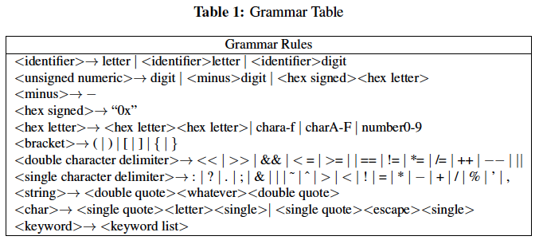
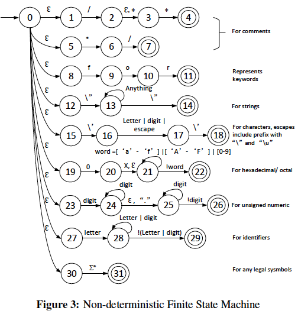
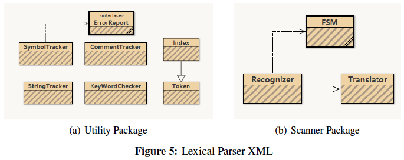
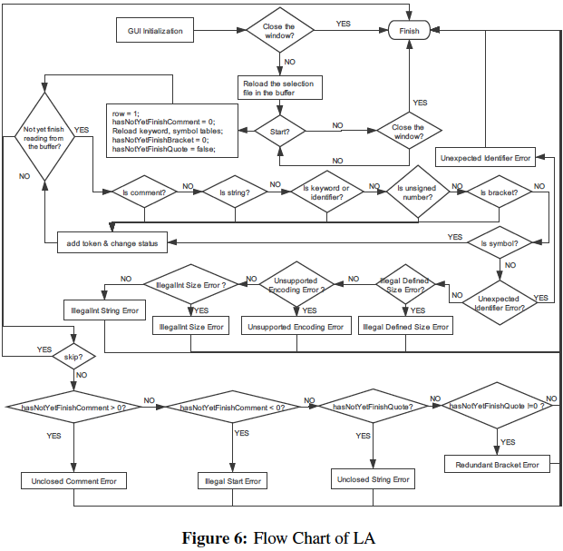
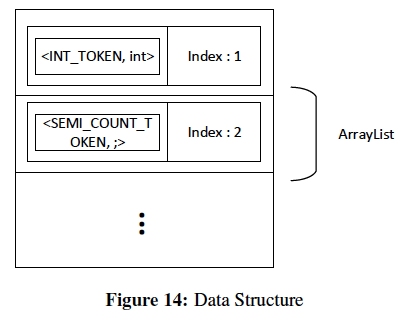

目录
=================
* [效果演示图](#效果演示图)
* [Java 实现词法分析器](#Java-实现词法分析器)
  * [项目介绍](#项目介绍)
     * [软件使用指南](#软件使用指南)
     * [软件设计与架构](#软件设计与架构)
        * [设计理念](#设计理念)
        * [软件架构](#软件架构)
  * [软件函数](#软件函数)
     * [识别器](#识别器)
     * [有限状态机](#有限状态机)
     * [翻译器](#翻译器)
  * [测试结果](#测试结果)
  * [下载](#下载)
      
# 效果演示图

<p align="center"></p>

# Java 实现词法分析器
[](https://github.com/Hephaest/LexicalParser/blob/master/LICENSE)
[](https://www.oracle.com/technetwork/java/javase/8u202-relnotes-5209339.html)
[](https://github.com/Hephaest/LexicalParser/raw/master/download/LexicalParser_windows-x64.exe)
[](https://github.com/Hephaest/LexicalParser/tree/master/src)

[English](README.md) | 中文

最后一次更新于 `2019/12/19`

## 项目介绍
词法分析器是编译器的重要组成部分用于生成某种形式的中间语言，该中间语言可用于将一种计算机编程语言转换为机器语言。 因此，本仓库引入了一种新的词法分析器软件，该软件可以准确有效地识别符号并报告错误。 本仓库的目的是帮助人们加深对词法分析器的理解。

### 软件设计与架构
我对词法分析器对于没有任何计算机相关背景的用户来说也是容易上手的。首先，用户可以点击 "Choose file" 来选择被读取的目标文件。

<p align="center"></p>

选择完毕后，用户可以点击 **Start** 按钮，程序将把文档分析成一串一串的令牌，生成结果如图2所示。如果文档中有词法错误，程序将会像图2(a)这样报错。检查完生成结果后，用户如果不想再继续分析别的文档，可以直接点击 **Finish** 按钮结束当前窗口(如图2(b)所示)。

<p align="center"></p>

### 软件设计与架构

本节分为两小节，分别为我的设计理念和相应的体系结构设计。我的设计理论基础来自于 *SCC.312的第7讲*。

#### 设计理念
由于 **有限状态机 (FMS)** 仅接受遵循某些语法规则的符号，因此我编写了自己的语法规则，FMS可以实现该规则以识别符号并捕获意外的标识符。表1中列出了详细的语法规则。在实践中，我将这些规则拆分为更多小规则，以使FMS能够识别每个规则。

<p align="center"></p>

如图3所示，我的FMS主要包含9个分支，每个分支代表一种类型的输入流。 我的词法分析器严格遵循Java的语法定义，通过以下过程的示意图，用户很容易直观地理解 Java 通用语法规则。

<p align="center"></p>

到目前为止，我们的讨论仍停留在理论上的实现方法上。但是，此FMS是 **非确定性有限状态机（NFMS）**，这意味着它本身很难实现。因此，在下一部分中，本仓库将介绍我的设计体系结构，该体系结构通过将此棘手的问题拆分为多个简单的 Java 模块来解决此问题。

#### 软件架构
如我们所知，词法分析器的简单组件是识别器和翻译器。我的架构设计基于这种简单的结构。识别者的职责是捕获所有合法符号，例如关键字，标识符等。在解析过程中，根据我的语法规则，如果有任何字符不能被接受，它将报告一个错误。对于翻译器，它将保存每个符号的类型和值，并根据需要为其提供唯一的类型代码。 这种简单的结构如图4所示。

<p align="center"></p>

此外，由于 NFMS 包含许多功能，因此我决定将这些功能作为多个单一的功能进行。另外，我专门为识别器、有限状态机和翻译器编写了多个模块，以区分它们的不同职责。我通过 BlueJ 创建了 UML 图，如图5所示，该图可以帮助您更轻松地理解不同角色之间的关系。

<p align="center"></p>

为了更好地理解词法分析器的过程，我绘制了一个流程图，如图6所示。检查过程的顺序(注释→字符串→关键字或标识符→数字→合法符号)是解析成功的关键。

<p align="center"></p>

除了一般的词法识别之外，我还添加了一些属于语法分析器的功能。比方说，我的词法分析器会跟踪所有类型的括号和注释符号，以检查通用编程语言语法。如果用户犯了一些低级的语法错误，那么这对分析器来说可是个轻松活了，我的词法分析器便可以快速解析这些错误并提供相关的警告。

为了模拟计算机对基本语言的执行，我选择了逐个字符地识别符号。我的词法分析器的主要技术是 **向前看**。 通常情况下，我的程序只向前看一步。但是，某些识别方法需要超过三步。

## 软件函数
软件的功能被分为不同的函数。在此存储库中，我将介绍我的核心算法。

### 识别器
在我的词法分析器中，识别器的主要作用是从缓冲区读取文件内容，并将这些字符串作为字符传输到 FMS，如下所示。
```java
    /**
     * This method is used to read the line character by character.
     * @param line The content of the file.
     * @param row The current row.
     * @return The parsing status.
     */
    private int checkEverySingleWord(String line, int row){
        for (col = 0; col < line.length(); col ++){
            if ((col = machine.changeState(line, col, row, sb)) == ERROR)
                return ERROR;
            sb.setLength(0);
        }
        return SUCCESS;
    }
```
识别器的另一个功能是成为一个简单的语法分析器。如前所述，我的识别器可以通过跟踪括号和注释的数量来找出注释和括号的多余符号。以下代码介绍了它的工作方式以及根据不同情况报告的错误类型。“skip” 表示发生了一些错误，因此不需要进一步分析。
```java
/**
     * This method is used to read the buffer line by line.
     */
    private void checkEverySingleLine() {

        boolean skip = false;
        try {
        while (((line = br.readLine())!= null)) {
            if (checkEverySingleWord(line, row) == ERROR) {
                skip = true;
                break;
            }
            row ++;
        }
        br.close();
        if (!skip) {
            /* If there is anything redundant, report an error. */
            if (ct.getCommentState() > 0){
                ErrorReport.unclosedComtError(ct.getUnclosedRowPos(), ct.getUnclosedColPos(), tArea);
                ErrorReport.parsingError(--row, col, tArea);
            } else if (ct.getCommentState() < 0){
                ErrorReport.illegalStartError(ct.getUnclosedRowPos(), ct.getUnclosedColPos(), tArea);
            } else if (strTracker.hasRedundantQuote()){
                ErrorReport.unclosedStrError(strTracker.getUnclosedRowPos(), strTracker.getUnclosedColPos(), tArea);
            } else if (!st.hasRedundantBrackets()){
                tArea.append("Successfully parsing!\n");
            }
        }
        // Set back to default state.
        finishBtn.setEnabled(true);
        openBtn.setEnabled(true);
        } catch (IOException e) {
            ErrorReport.ioError(tArea);
        }
    }
```
### 有限状态机
有限状态机在我的词法分析器中承担了主要的识别工作。首先，程序将检查注释状态。如果还没有遇到相应的闭注释符号，则我们认为当前行在注释中。换句话说，不需要进一步的必要检查。但是，此过程非常复杂，因此应考虑一些极端错误情况。代码如下所示。
```java
/**
     * This method is used to record the number of open or close comment symbol and then change to another state.
     * @param line The content of the file.
     * @param col The current column.
     * @param sb The object of StringBuilder class.
     * @return The next state of FMS.
     */
    private int isComment(String line, int col, StringBuilder sb) {

        char c = line.charAt(col);
        // Look ahead one step.
        int lookForward = col + 1;
        boolean skip = false;

        // If the string is "*/".
        if (c == '*' && lookForward < line.length() && line.charAt(lookForward) == '/') {
            skip = true;
            ct.setCommentState(-1);
            if (ct.getCommentState() == -1) ct.updateUnclosedPosition(row, col);
        } else if (c == '/' && lookForward < line.length() && (line.charAt(lookForward) == '*')) {
            // The current string is "/*".
            skip = true;
            ct.setCommentState(1);
            if (ct.getCommentState() == 1) ct.updateUnclosedPosition(row, col);
        }
        // Skip the col we have checked.
        col = (skip)? lookForward : col;
        if (ct.getCommentState() == 0) {
            // If the string is "//", just ignore rest of the line.
            if (c == '/' && line.charAt(lookForward) == '/') return line.length() - 1;
            // Go to the next state of FMS.
            return isString(c, line, col, sb);
        } else  {
            /* Complex situation, only return the column of the last index of the target symbol. */
            int finalPos = 0;
            int endPos = line.indexOf("*/", col) + 1;
            int startPos = line.indexOf("/**", col) + 2;
            if (startPos != 1) {
                finalPos = Math.max(startPos, endPos);
                if(startPos > endPos) ct.setCommentState(1);
                return finalPos;
            } else if ((startPos = line.indexOf("/*", col) + 1) != 0){
                if(startPos > endPos) ct.setCommentState(1);
                finalPos = Math.max(startPos, endPos);
                return finalPos;
            } else if (endPos != 0){
                ct.setCommentState(-1);
                return endPos;
            } else {
                // Finish, go to next line.
                return line.length() - 1;
            }
        }
    }

```
在检查当前字符串是关键字还是标识符时，使用的方法是向前看 N 步。由于 Java 允许标识符以 `_` 或 `$` 作为前缀，因此我的词法分析器也遵循相同的语法规则。代码如下所示。
```java
/**
     * This method is used to check whether the current symbol is keyword or identifier.
     * @param c The current character.
     * @param line The content of the file.
     * @param col The current column.
     * @param sb The object of StringBuilder class.
     * @return The next state of FMS.
     */
    private int isKeywordOrIdentifier(char c, String line, int col, StringBuilder sb){
        /* Java allows the identifier with prefix of "_" or "$" */
        if(isLetter(c) || c == '_' || c == '$'){
            sb.append(c);
            col ++;

            while (col <line.length() && (c = line.charAt(col)) != ' '){
                if(st.isSpecialSymbol(c)) {
                    col--;
                    break;
                }
                sb.append(c);
                col ++;
            }
            String word = sb.toString();
            if(isPreservedWord(word)) translator.addToken(word.toUpperCase() + "_TOKEN", word, tArea);
            else if (!isLargerThan32Byte(word, col)) {
                translator.addToken("IDENTIFIER_TOKEN", word, tArea);
            } else {
                ErrorReport.illegalDefinedSizeError(row, col, tArea);
                return REPORT_ERROR;
            }
            return col;
        }
        return isUnsignedNumber(c, line, col, sb);
    }
```
我们还应该留意用户定义的标识符的长度最大为32个字节。相应功能如下所示。
```java
/**
     * This method is used to check whether the length of user defined identifier's name exceeds the 32 Bytes.
     * @param identifier The name of user defined identifier.
     * @param col The current column.
     * @return A boolean result.
     */
    private boolean isLargerThan32Byte(String identifier, int col){
        try {
            if (identifier.getBytes("utf-8").length > 32) return true;
        } catch (UnsupportedEncodingException e) {
            ErrorReport.unsupportedEncodingError(row, col, tArea);
            return true;
        }
        return false;
    }
```
另一种更复杂的**朝前看N步**算法被用于检查它是**字符串**类型还是**字符**类型。实际上，从String类型中提取字符串很容易。 但是，在识别 **Char** 类型时变得非常困难。不注意细节的朋友们可能认为该模式仅仅应用于单字符如`a`这样的场景。这是完全错误的，**Char** 类型是最复杂的类型，因为它可以组合转义字符(例如'\u0024'，'\000'和'\b')。这要求我的词法分析器**最多**向前看三步。完整的识别过程如下所示。
```java
/**
     * This method is used to check whether the current symbol is start of string or character.
     * @param c The current character.
     * @param line The content of the file.
     * @param col The current column.
     * @param sb The object of StringBuilder class.
     * @return The next state of FMS.
     */
    private int isString(char c, String line, int col, StringBuilder sb){
        int lookForwardOneStep = col + 1;
        int lookForwardTwoSteps = col + 2;
        if(c == '\"') {
            /* This line maybe contains a string. Mark it. */
            if (strTracker.hasRedundantQuote()) {
                strTracker.addStringToToken(translator, tArea);
                strTracker.setStrState();
            } else {
                strTracker.clearBuilder();
                strTracker.setStrState();
                strTracker.updateUnclosedPosition(row, col);
            }
        } else if (c == '\'' && lookForwardOneStep < line.length() && line.charAt(lookForwardOneStep) == '\\'){
            /* This is maybe a escape character. */
            char lookFwdChar = line.charAt(lookForwardTwoSteps);
            char lookFwdNextChar = line.charAt(col + 3);
            char[] list = {'\"','\'','\\','r','n','f','t','b'};
            for (char item : list) {
                if (item == lookFwdChar && lookFwdNextChar == '\'') {
                    translator.addToken("CHAR_TOKEN", "\\" + item, tArea);
                    return col + 3;
                }
            }

            if (lookFwdChar == 'u') col = col + 3; // Need to look ahead 3 steps.
            else col = col + 2;

            builder.setLength(0);
            while (col < line.length() && (c = line.charAt(col)) != '\''){
                if (!Character.isDigit(c)) {
                    /* This is definitely not a character. */
                    ErrorReport.unclosedCharError(row, col, tArea);
                    builder.setLength(0);
                    return REPORT_ERROR;
                }
                builder.append(c);
                col++;
            }

            /* Check out whether the current character is the start of Hexadecimal or octal character. */
            if (Integer.valueOf(builder.toString(),8) >= Integer.valueOf("000",8) &&
                    Integer.valueOf(builder.toString(),8) <= Integer.valueOf("377",8)){
                translator.addToken("CHAR_TOKEN", "\\u" + builder.toString(), tArea);
                return col;
            } else if (lookFwdChar == 'u' && Integer.valueOf(builder.toString(),16) >= Integer.valueOf("0000",16)
                    && Integer.valueOf(builder.toString(),16) <= Integer.valueOf("FFFF",16)){
                translator.addToken("CHAR_TOKEN", "\\" + builder.toString(), tArea);
                return col;
            } else {
                ErrorReport.unclosedCharError(row, col, tArea);
                return REPORT_ERROR;
            }

        } else if (c == '\'' && lookForwardTwoSteps < line.length() && line.charAt(lookForwardTwoSteps) == '\'') {
            /* This is definitely a character. */
            translator.addToken("CHAR_TOKEN", Character.toString(line.charAt(lookForwardOneStep)), tArea);
            return col + 2;
        } else if (c == '\'') {
            /* This is definitely character syntax error. */
            ErrorReport.unclosedCharError(row, col, tArea);
            return REPORT_ERROR;
        } else if (strTracker.hasRedundantQuote()) {
            /* Must belong to a string. */
            strTracker.appendChar(c);
            return col;
        }
        // Go to the next state of FMS.
        return isKeywordOrIdentifier(c, line, col, sb);
    }
```
### 翻译器
翻译器的职责是从 FMS 收集令牌，并为每个令牌生成唯一的ID。我制作了一个 Token 类，该类专门用于生成令牌。然后，我创建了一个名为 Index 的新类来扩展 Token 类，以便为每个令牌生成唯一的ID。最后，所有标记将有序地附加到 ArrayList 中，该列表跟踪标记及其位置，以进行进一步的语法分析。不同数据结构内的关系如图14所示。

<p align="center"></p>

Translator类的基本操作如下所示。
```java
public class Translator {
    // Variables declaration
    private int id;
    private ArrayList<Index> orders = new ArrayList<Index>();

    /* Initialization. */
    public Translator () {
        id = 0;
    }

    /**
     * This method is used to add a token into its ArrayList.
     * @param type The type of the token.
     * @param value The value of the token.
     * @param tArea The object of JTextArea class.
     */
    public void addToken(String type, String value, JTextArea tArea){
        /* If the current token exists, do not create a new object. */

        if (!isExist(value, tArea)) {
            Index index = new Index(type, value, ++id);
            tArea.append("< " + type + ", " + value + ", " + id + " >" + "\n");
            orders.add(index);
        }

    }

    /**
     * This method is used to check whether the current token exists or not.
     * @param value The value of the token.
     * @param tArea The object of JTextArea class.
     * @return A boolean checking result.
     */
    private boolean isExist(String value, JTextArea tArea){
        for (Index index : orders) {
            if (index.equals(value)) {
                tArea.append(index.getInfo());
                orders.add(index);
                return true;
            }
        }
        return false;
    }
}
```
## 测试结果
下图列出了成功解析和错误警告的示意结果。

<p align="center"></p>

<p align="center"></p>

测试样本已上传到[这里](https://github.com/Hephaest/LexicalParser/tree/master/test).

## 下载
由于许可证的问题，目前仅提供 Windows 平台的执行程序，如果您感兴趣可点击下方链接直接下载安装。

**适用于 Windows 64 位**: [Download here](https://github.com/Hephaest/LexicalParser/raw/master/download/LexicalParser_windows-x64.exe)
